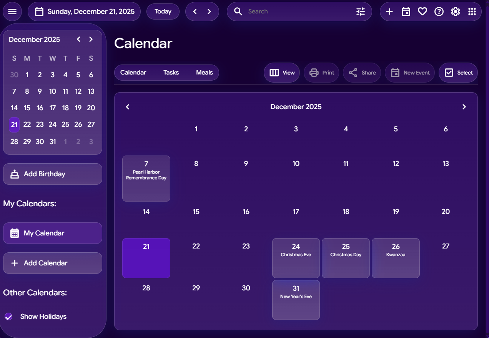

# 📅 Munetios Calendar 3.0

A **fast, private, and modern calendar app** built with performance, simplicity, and user control in mind.

Munetios Calendar is designed to work **without accounts, without tracking, and without analytics** — your schedule stays on your device.

---

## 🖼️ Preview



---

## ✨ Features

* 🚀 **Ultra-fast** — no backend, no sync delays
* 🔒 **Privacy-first** — zero tracking, zero analytics
* 📆 **Month, week, and day views**
* 🕒 **Accurate date & time handling** (DST-safe)
* 🧠 **Clean UI logic** — predictable and stable
* 🌐 **Works offline** (after first load)
* 🧊 **Modern Liquid-Glass inspired design**

---

## 🧩 Philosophy

Munetios Calendar is built with a simple rule:

> **A calendar should be reliable, fast, and private — nothing more, nothing less.**

No accounts. No data collection. No cloud dependency.

---

## 🚀 Live Demo

👉 **[https://calendar.munetios.com](https://calendar.munetios.com)**

(Hosted via GitHub Pages with a custom domain)

---

## 🛠️ Tech Stack

* **HTML** — lightweight and portable
* **CSS** — custom styling (Liquid Glass aesthetic)
* **JavaScript** — deterministic client-side logic only

No frameworks. No heavy dependencies.

---

## 📦 Installation / Usage

This project is fully static.

### Option 1: Open locally

```bash
Open index.html in your browser
```

### Option 2: Host anywhere

You can deploy this on:

* GitHub Pages
* Cloudflare Pages
* Any static hosting provider

---

## 🧪 Stability

* ✅ **Version:** 3.0 Stable
* ✅ **No known bugs** at release
* ✅ Extensively tested through real-world usage and multiple deployments

---

## 📜 License

Munetios License v1.5 © 2026 Munetios

You are free to use, modify, and distribute this project.

---


## ❤️ Built by

**Munetios** — focused on privacy-first, fast, and beautifully designed web apps.
